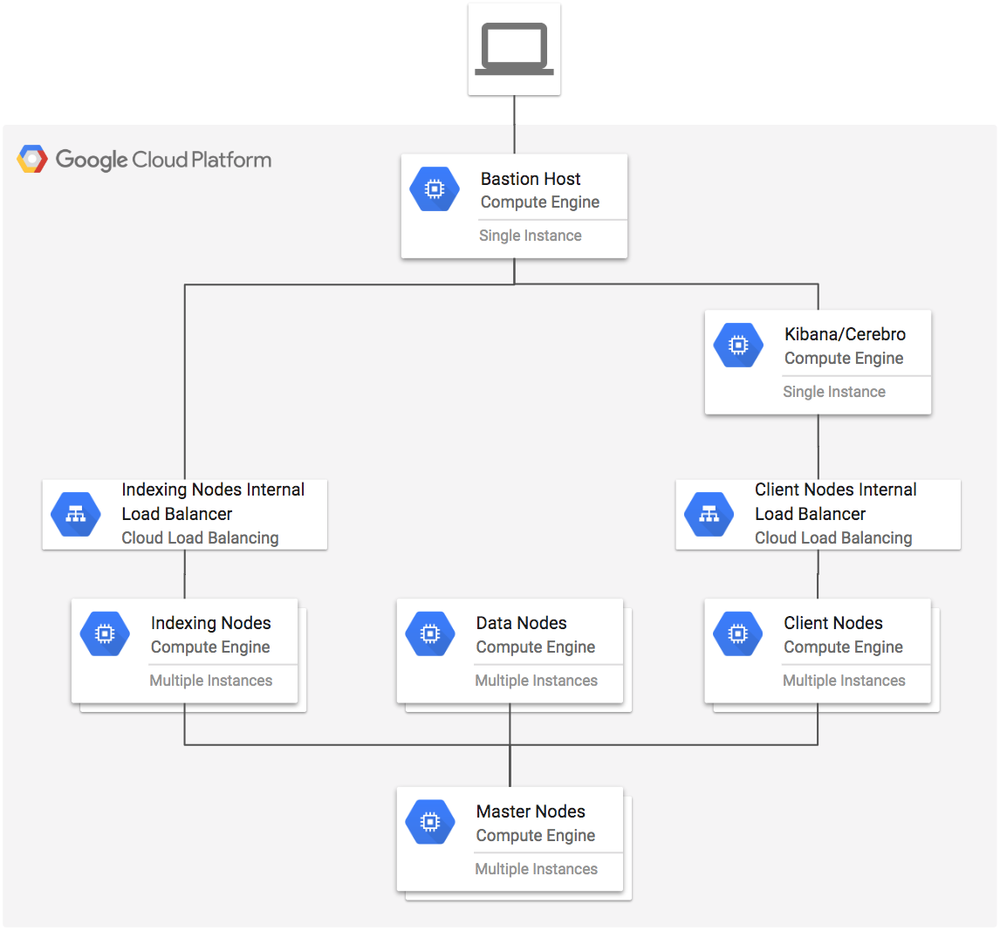

# Multi node Elasticsearch Cluster with Stateful Data Nodes

[](https://console.cloud.google.com/cloudshell/open?git_repo=https://github.com/danisla/terraform-google-elasticsearch&page=editor&tutorial=examples/multi-node/README.md)

This example creates a multi node Elasticsearch cluster with master, data and client nodes with no external IPs and a NAT gateway.

**Figure 1.** *diagram of Google Cloud resources*



## Install Terraform

Install Terraform on Linux if it is not already installed (visit [terraform.io](https://terraform.io) for other distributions):

```
curl -sL https://goo.gl/UYp3WG | bash
source ${HOME}/.bashrc
```

## Setup Environment

```
cd examples/multi-node
```

Set the project, replace `YOUR_PROJECT` with your project ID:

```
gcloud config set project YOUR_PROJECT
```

```
test -z DEVSHELL_GCLOUD_CONFIG && gcloud auth application-default login
export GOOGLE_PROJECT=$(gcloud config get-value project)
```

## Configure remote backend

Configure Terraform [remote backend](https://www.terraform.io/docs/backends/types/gcs.html) for the state file.

```
BUCKET=${GOOGLE_PROJECT}-terraform
gsutil mb gs://${BUCKET}

PREFIX=tf-es-multi-node-stateful/state
```

```
cat > backend.tf <<EOF
terraform {
  backend "gcs" {
    bucket     = "${BUCKET}"
    prefix     = "${PREFIX}"
  }
}
EOF
```

## Run Terraform

```
terraform init
terraform plan
terraform apply
```

## Testing

SSH into the bastion host with port forwarding to Cerebro and Kibana:

```
eval $(ssh-agent)
ssh-add ~/.ssh/google_compute_engine
eval $(terraform output bastion)
```

Open a local browser to view Cerebro and Kibana:

`walkthrough spotlight-pointer devshell-web-preview-button "Open Web Preview and change port to 9000"`

`walkthrough spotlight-pointer devshell-web-preview-button "Open Web Preview and change port to 5601"`

Install [esrally](https://github.com/elastic/rally) and run benchmark

```
sudo yum install -y centos-release-scl && sudo yum install -y gcc python34.x86_64 python34-devel.x86_64 python34-pip.noarch java-1.8.0-openjdk java-1.8.0-openjdk-devel git19 tmux && sudo pip3 install --upgrade pip && sudo pip3 install esrally

scl enable git19 bash
esrally configure

INDEX_NODES="$(gcloud compute instances list --filter=name~tf-es-cluster-indexing- --format='value(networkInterfaces[0].networkIP)' | sed -e ':a' -e 'N' -e '$!ba' -e 's/\n/:9200,/g'):9200"

esrally --track=http_logs --target-hosts="${INDEX_NODES}" --pipeline=benchmark-only
```

## Cleanup

Exit the bastion ssh session:

```
exit
```

Remove all resources created by terraform:

```
terraform destroy
```
